👋 Hi, I’m Haseeb Yaseen

💻 Laravel Developer | Backend Engineer

🚀 About Me

I’m a self-taught developer who turned curiosity into a career. I started coding in 6th grade, built my first Laravel project at 17, and since then I’ve been focused on backend development.

From learning independently → interning at Techsops Pvt Ltd → to now working as a Junior Laravel Developer, my journey has always been about building real-world applications and improving every day.

🛠️ Skills & Technologies

Backend: Laravel, PHP

Database: MySQL, Eloquent ORM

Frontend (basic): Blade, TailwindCSS, Livewire

Other Tools: Git, GitHub, REST APIs, Authentication & Authorization

📂 Featured Projects

🔐 AuthMaster – A Laravel starter kit with authentication, roles & permissions

📊 Expense Tracker – Finance tracking app with dashboards & reports

📝 Quiz App – Online quiz system with result analytics

👉 Explore my pinned repositories below to see my work in action.

🌍 Connect with Me

   

⚡ Less talk, more code. I let my projects speak for me.

<picture>
  <source media="(prefers-color-scheme: dark)" srcset="dark.svg">
  <source media="(prefers-color-scheme: light)" srcset="light.svg">
  
</picture>
